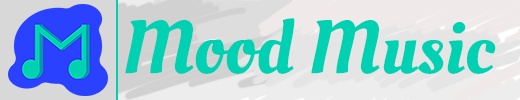
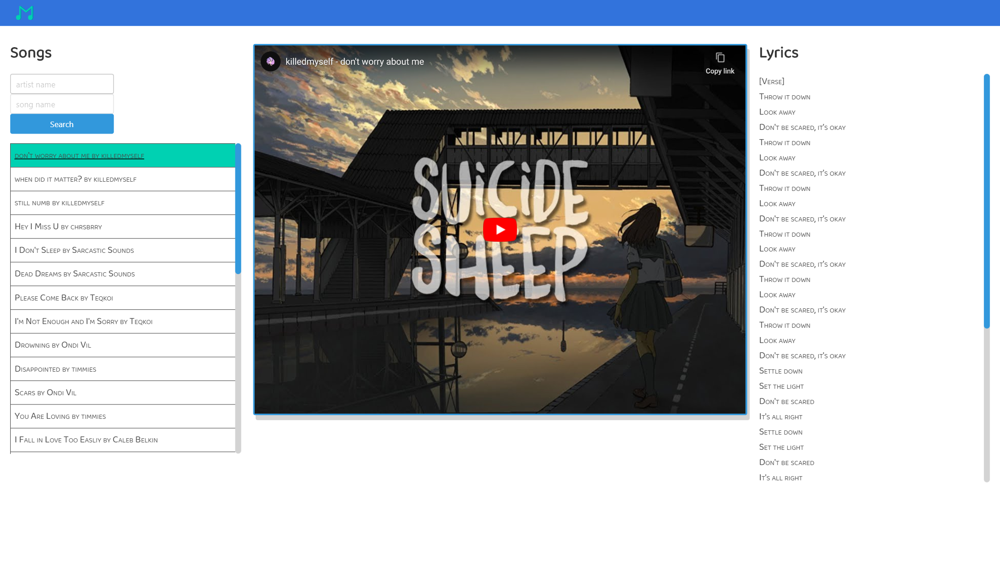
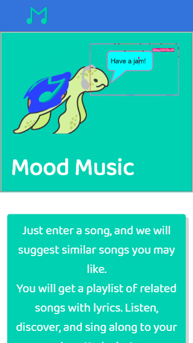
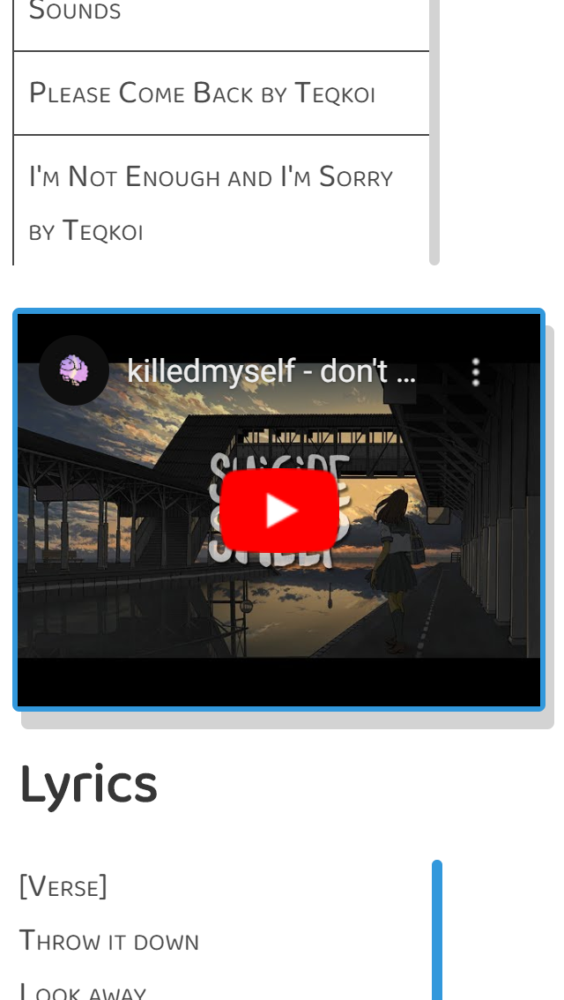

# Mood Music

[](https://choosealicense.com/licenses/mit/) [](https://bookstore.personal-projects.space/) [](https://app.netlify.com/sites/specialmoodmusic/deploys)

**You can access the deployed project here: <https://moodmusic.today/>**

### _Just enter a song and you will get a playlist of related songs with lyrics. Listen, discover, and sing along to your heart’s desire!_

#### Do you ever feel like you are completely lost with music and you are not sure what to listen to next? Do you want to discover new music and make it in a _convenient_ way?

You can do it now. Introducing [**Mood Music**](https://mi544.github.io/mood-music/)!  
Enter your favorite song, or choose one that reflects your current mood. Enter it into the app and click "**Search**".  
Enjoy a fine-tuned list of recommendations based on the song you entered (by [LastFM](https://www.last.fm/)), listen to similar music from [YouTube](https://www.youtube.com/), and sing along to the songs with the exclusive lyrics section (by [Genius.com](https://genius.com/)), all from the same page!  
_Choose your song and enjoy!_

---

# Index

1. [Features](#features)
2. [Why serverless?](#why-serverless)
3. [Resources](#resources)
4. [Installation](#installation)
5. [Deployment](#deployment)
6. [Authors](#authors)
7. [Screenshots](#screenshots)

# Features

What can it do? What can it not!

- _"No-Cookie"_ version of YouTube is used to respect users' privacy - no songs are ever saved in the YouTube watch history, which makes discovering new music easier - music discovered from this app is not going to affect YouTube recommendations
- Custom logos and assets, **_the tortoise_**!
- Minimalistic design and great color palette that feels right
- 100% mobile responsive and comfortable to use
- Fine-tuned list of similar song in seconds
- YouTube embedded video of the song currently chosen
- Once a song finishes, the next song in the playlist starts playing automatically
- Complete and accurate, best in the industry lyrics brought by [Genius.com](https://genius.com/)
- Currently playing song is always highlighted so it's easy to find
- Songs that have been played are grayed out, providing useful visual cues and allowing to discover new songs more easily

# Why serverless?

Given the strict client-side-only constraint, this project initially used a public [CORS proxy](https://github.com/Rob--W/cors-anywhere) as a workaround for some API issues, which proved to be very unreliable. In addition to that, [YouTube Scrape](https://github.com/HermanFassett/youtube-scrape) was deployed on a free-tier [Heroku](https://www.heroku.com/) instance, and while working fine from there in general, it routinely took additional ~15 seconds of cold start, which meant ~15 seconds of the user waiting for a video to load, which was a terrible user experience.  
In an effort to resolve these issues, the aforementioned repositories were deployed to a separate VPS with special domains assigned to them. It has solved the cold-start issue and improved general availability and reliability, but with time managing and maintaining all the deployed sub-projects became difficult.  
This project was then rewritten entirely to rely on [Netlify Serverless Function](https://functions.netlify.com/playground/) as a step towards more reliable service and a more effortless deployment process, thus avoiding any back-end in the traditional sense.

# Resources

| Name | Description |
| --- | --- |
| [jQuery ](https://jquery.com/) | [jQuery](https://jquery.com/) is used in this project almost exclusively to target and interact with the DOM. API requests are being carried out using the [Fetch API](https://developer.mozilla.org/en-US/docs/Web/API/Fetch_API) built into all latest browsers. |
| [Tippy.JS ](https://atomiks.github.io/tippyjs/) | Based on [Popper.JS](https://popper.js.org/), this library allows to use tooltips, popovers, dropdowns and menus out of the box, with little to no additional setup necessary. The primary use in this project is the library's cute tooltips to notify the user of miscellaneous errors (e.g. if a requested song could not be found) and to provide better, more wholesome user experience. |
| [Bulma ](https://bulma.io/) | [Bulma](https://github.com/jgthms/bulma) is a free open-source CSS framework based on flexbox. It was created with mobile responsiveness in mind, which is one of the main goals what this project aimed to achieve. [Bulma](https://github.com/jgthms/bulma) was used to build page layouts quickly and effortlessly thanks to the extensive list of classes provided by the framework. This library allowed to spend more time on fine-tuning styling particular elements and making use of a wider range of 3-rd party APIs that could improve user experience rather than styling everything from scratch. |
| [LastFM API ](https://www.last.fm/api/) | [LastFM](https://www.last.fm/) is a service that allows anyone to "scrobble" their music while listening to it, essentially recording and keeping track of all the music they listen to. [LastFM](https://www.last.fm/) is used by millions of users every day, and because of that it has an extensive collection of similar songs that people like. It has an open API that allows, among other things, to request information about songs and get similar songs. The [LastFM's](https://www.last.fm/) _Track.getInfo_ and _Track.getSimilar_ API methods are used extensively in this project so that users can easily find similar songs based on the one they entered. |
| [YouTube Scrape ](https://github.com/HermanFassett/youtube-scrape) | [YouTube Scrape](https://github.com/HermanFassett/youtube-scrape) is a useful library that parses YouTube search results with a given search query and returns all videos from the page. It serves as a good substitution to the official [Google's YouTube V3 API](https://developers.google.com/youtube/v3/), which is highly restrictive in the amount of requests it allows a day. This library's response is well-formatted and is easy to parse and work with. This project retrieves the first result from the YouTube search and displays it as an embedded element. |
| [Genius.com ](https://genius.com/) | [Genius.com](https://docs.genius.com/) is a crowd-based service that allows users to add and edit song lyrics. It is very popular, and because it is user-based, it contains an extensive amount of songs with properly written lyrics. [Genius API](https://docs.genius.com/) requires back-end based authentication for most of its API methods, but it allows the use of an API key to retrieve simple search results. This project takes advantage of that and uses [Genius API](https://docs.genius.com/) to make simple calls to retrieve the first result from the search. This project takes the task of getting proper lyrics so seriously, a special function with [regex](https://developer.mozilla.org/en-US/docs/Web/JavaScript/Guide/Regular_Expressions) and other methods is implemented for scraping song lyrics and natively displaying them in the app. |
| [Netlify ](https://www.netlify.com/) | This project is deployed on Netlify, which is a great serverless platform allowing to build and deploy apps quickly and effortlessly. |

# Installation

You need [Node.js](https://nodejs.org/en/), [yarn package manager](https://yarnpkg.com/), [Vite](https://vitejs.dev/), and [Netlify CLI](https://cli.netlify.com/) installed to run this app.

Rename the `/.env.example` file to `/.env`. If you want to run the serverless functions locally, granted that [Netlify CLI](https://cli.netlify.com/) runs on port `9999` by default, adjust the variable from

```
VITE_SERVERLESS_URL=/.netlify/functions
```

to

```
VITE_SERVERLESS_URL=http://localhost:9999/.netlify/functions
```

---

To install all the dependencies required to run this app, in the project root folder run

```bash
yarn
```

To start this app locally, run

```bash
yarn dev
```

Since this project uses [Vite](https://vitejs.dev/), `yarn dev` will start a local dev server.

---

To run the serverless functions locally, run

```bash
netlify functions:serve
```

This will start up a dev server and the functions will be available at `http://localhost:9999/.netlify/functions`. I honestly have no idea how to set environment variables locally with Netlify CLI when running `netlify functions:serve`, and this issue <https://github.com/netlify/netlify-lambda/issues/118> may be of help, but for the time being you can replace

```
const { GENIUS_API_KEY } = process.env
const { LASTFM_API_KEY } = process.env
```

with

```
const GENIUS_API_KEY = 'YOUR_API_KEY'
const LASTFM_API_KEY = 'YOUR_API_KEY'
```

in respective serverless function files.

Do not commit these files before changing it back. This setup is not ideal but will definitely work. If you know a better solution please open an issue! Thank you!

# Deployment

This app was designed to work with [Netlify](https://www.netlify.com/) and therefore can be deployed on [Netlify](https://www.netlify.com/) as is. To deploy on [Netlify](https://www.netlify.com/), follow the traditional deployment process. Since this project uses [Vite](https://vitejs.dev/), the **publish directory** is `dist`, the **build command** is `yarn build`. Learn more about deploying with Vite on Netlify here: <https://vitejs.dev/guide/static-deploy.html#netlify>

The front-end requires one environment variable to be set before starting the build process, as is listed in the `/.env.example`  
Set the following environment variable in Netlify GUI under **Site Settings**

```
VITE_SERVERLESS_URL=/.netlify/functions
```

The serverless functions require two environment to be set before starting the build process, as is listed in the `/netlify/functions/.env.example` Set the following environment variables in Netlify GUI under **Site Settings**

```
LASTFM_API_KEY=0000000000000
GENIUS_API_KEY=xxxxxxxxxxxxxxxxxxxxxx
```

Replace the values with real API keys for LASTFM <https://www.last.fm/api> and Genius <https://docs.genius.com/> (you need the `access_token` value)

Once all three environment variables are added on Netlify, trigger a build again. This is needed due to the fact that environment variables are cached on build and are not dynamically tracked.

---

This project's serverless functions can be deployed with [AWS Lambdas](https://aws.amazon.com/lambda/) but would require slight modifications to the code of the functions. Netlify uses AWS Lambda service behind the scenes, so the code doesn't require a lot of adjustments. Although while Netlify provides all npm modules out of the box, AWS Lambda service doesn't. You need to install `axios` module and have it available in `node_modules` folder prior to bundling the functions. You can bundle the functions one by one or together. You may have to change front-end service clients request URLs to your own API Gateway URLs from AWS. They can be found in `/assets/js/serviceClients.js`.

Deploying static files shouldn't differ too much.  
Make sure you have a `.env` file at the root project level with one variable pointing at the location of your serverless functions

```
VITE_SERVERLESS_URL=/.netlify/functions
```

Then trigger the build by running `yarn build`. The static assets will be located in the `/dist` directory.

# Authors

- Maksim Verkhoturov
- Jared Schau
- Mark McKenna
- Preston Patterson

# Screenshots

| Welcome Page | Song Page |
| --- | --- |
|  |  |
|  |  |
|  |  |

 

[](#index)
