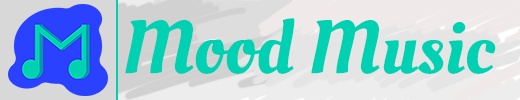
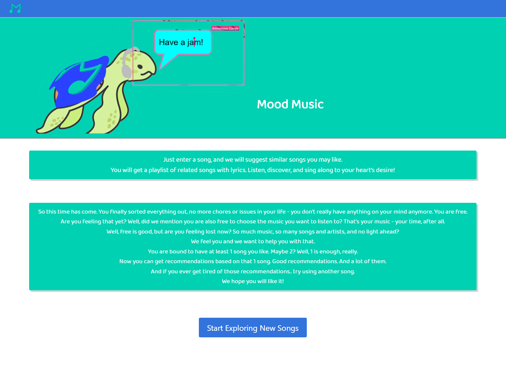
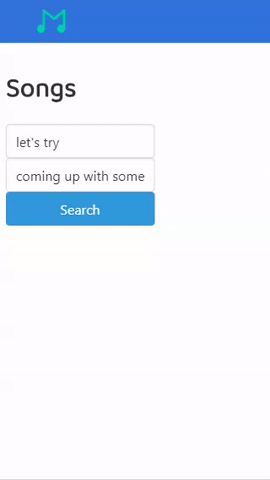
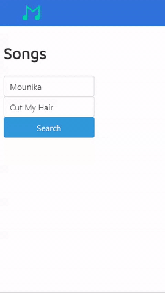
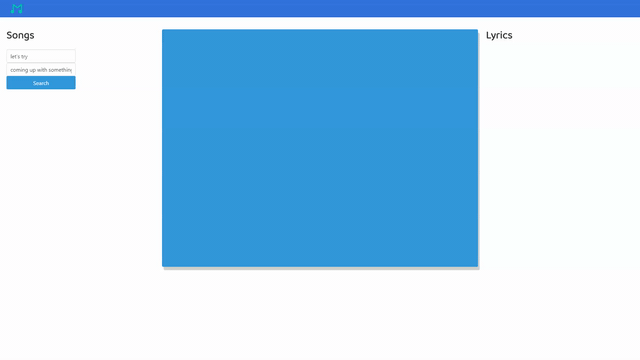

# Mood Music

**You can access the deployed project here:
<https://mi544.github.io/mood-music/>**

### *Just enter a song, and you will get a playlist of related songs with lyrics. Listen, discover, and sing along to your heart’s desire!*

#### Do you ever feel like you are completely lost with music and you are not sure what to listen to next? Do you want to discover new music and make it in a _convenient_ way?

You can do it now. Introducing [**Mood Music**](https://mi544.github.io/mood-music/)! Enter your favorite song, or choose one that reflects your mood. Plug it into the app (watch for spelling though) and click "**Search**". Enjoy having a fine-tuned list of recommendations based on your song. Watch it through YouTube embedded elements right from the app, and sing along with the lyrics on that same page. *Choose your song and enjoy!*

---
# Index

1. [Resources Used](#Resources-Used)
2. [Features](#Features)
3. [Authors](#Authors)

# Resources Used

| Name | Description |
| ---- | ----------- |
| [jQuery](https://jquery.com/)  | We used [jQuery](https://jquery.com/) in this Project to target HTML elements, pull/assign attributes and make ajax calls to APIs and webpages.
| [Tippy.JS](https://atomiks.github.io/tippyjs/)  | Based on [Popper.JS](https://popper.js.org/), this library allow you to use tooltips, popovers, dropdowns and menus out of the box, with little to no additional adjustments necessary. We made use of tooltips to notify the user if we couldn't find a song requested or if it wasn't popular enough for us to give aN educated recommendation on it.
| [Bulma](https://bulma.io/)  | [Bulma](https://github.com/jgthms/bulma) is a free open-source CSS framework based on Flexbox. It was created with mobile responsiveness in mind, which was ideal for us. We used [Bulma](https://github.com/jgthms/bulma) to build our pages' layout quickly and almost effortlessly thanks to the extensive list of classes provided by the framework. Thanks to [Bulma](https://github.com/jgthms/bulma) we had more time to focus on fine-tuning styling of particular elements, and we had more time to dedicate to discussing, experimenting and using various APIs through JavaScript.
| [LastFM API](https://www.last.fm/api/)  | [LastFM](https://www.last.fm/) is a service that allows anyone to "scrobble" their music while listening to it, essentially recording and keeping a complete list of all the music they ever listened to, how many times they did it and at what exact time of the day they did it. [LastFM](https://www.last.fm/) is used by millions of users every day, and, because of that, it has an extensive collection of similar songs that people like. It has an open and free API that allows to request information about songs, get similar songs based on one song passed, get tag information and even update profile information through the API. We made use of [LastFM's](https://www.last.fm/) _Track.getInfo_ and _Track.getSimilar_ API methods. We set a limit to 30 songs a query, and after the user enters their favorite song, we then display similar songs received from [LastFM](https://www.last.fm/) in our app.
| [YouTube Scrape](https://github.com/HermanFassett/youtube-scrape)  | [YouTube Scrape](http://youtube-scrape.herokuapp.com/api/search) is a back-end based app hosted on [Heroku](https://www.heroku.com/) as a [Node.js](https://nodejs.org/) app. It is used as a simple API. It parses [YouTube's] (https://www.youtube.com/) search results with a given search query and returns all the results from the page. We didn't use [YouTube's Data API](https://developers.google.com/youtube/v3/getting-started) because, as we discovered soon enough after doing some testing, it had a very small limit of search queries a day, which was exactly what we needed. We quickly hit the limit and found another solution, while still remaining strictly client-side. This API's response is then used to parse and retrieve the first result from the search, so that it can be displayed as a [YouTube](https://www.youtube.com/) embedded element in our app.
| [Genius.com](https://genius.com/)  | [Genius.com](https://docs.genius.com/) is a crowd-based service that allows users to add and edit song lyrics. It is very popular, and because it is user-based, it contains an extensive amount of songs with properly written lyrics. [Genius API](https://docs.genius.com/) requires back-end based authentication for most of its API methods, but it allows using an API KEY to retrieve simple search results. We took advantage of that and used [Genius API](https://docs.genius.com/) to make simple calls to retrieve the first result from the search it returns. We then took the task to the next level and implemented scraping using [REGEX](https://developer.mozilla.org/en-US/docs/Web/JavaScript/Guide/Regular_Expressions) along with other methods to scrape song lyrics and natively display them in our app.
| [CORS Anywhere](https://github.com/Rob--W/cors-anywhere)  | [CORS Anywhere](https://cors-anywhere.herokuapp.com/) is a back-end application that acts as a proxy that provides us with a way to conveniently request webpages as HTML while still remaining strictly client-side. We had to resort to using a proxy because it would be impossible to request webpages to scrape them later all while remaining client-side, because of the [CORS headers](https://developer.mozilla.org/en-US/docs/Web/HTTP/CORS). We used [CORS Anywhere](https://cors-anywhere.herokuapp.com/) to make request to [YouTube Scrape API](http://youtube-scrape.herokuapp.com/api/search) and [Genius.com](https://genius.com/) song webpages. It works great and is relatively fast to handle most of the tasks we have for it.
***

# Features
What can it do? What can it not!

* _"No-Cookie"_ version of YouTube is used to respect your privacy - it isn't going to be saved in your YouTube watch history and is not going to affect your YouTube recommendations!
* Custom SVG logo, high-quality favicon, **_the tortoise_**!
* Minimalistic design to make the app look impeccable
* Great color palette that feels right
* Completely, 100% mobile responsive and comfortable to use (even the tooltips work on mobile!)
* Fine-tunes list of similar song in just a second
* YouTube embedded video of the song **you** chose to listen to
* Complete, accurate, full and best in the industry lyrics, parsed right from [Genius.com](https://genius.com/) (careful, they're still hot!)
* Never get lost in the list (enough of getting lost!) - currently playing song is always highlighted in the list so you never lose it
* Songs you already listened to are indicated are grayed out, so you always know what to listen to next!
* Don't like the song? Change the whole list of recommendations in a matter of seconds.
* Verbose logging in the developer console

# Authors
* Maksim Verkhoturov
* Jared Schau
* Mark McKenna
* Preston Patterson
* Connor Clare

| Welcome Page | Song Page |
| ------------ | --------- |
| 
 | 
 | 

